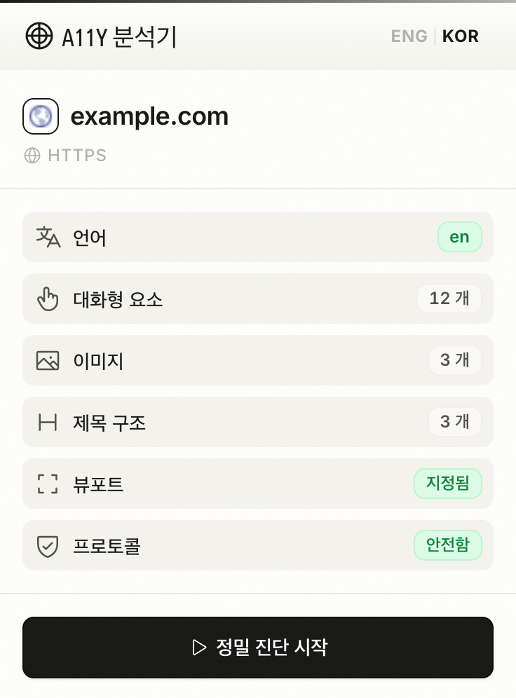
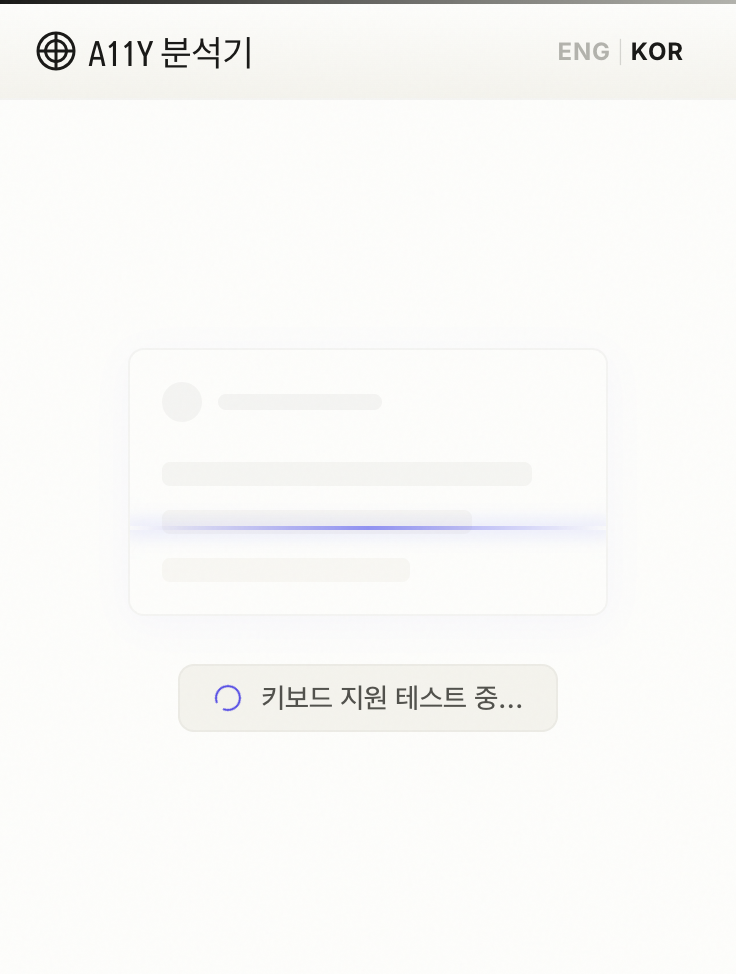
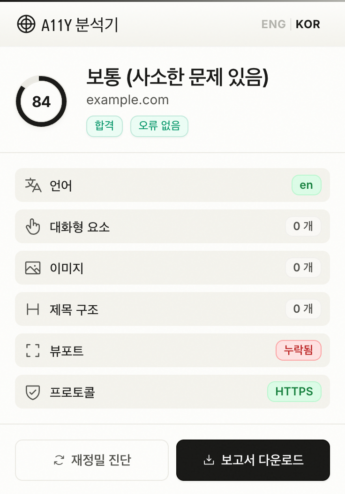
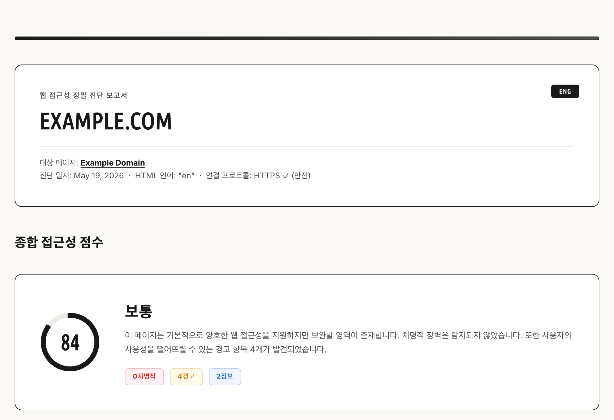
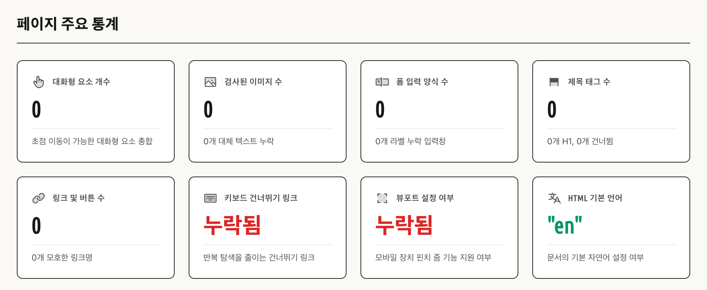
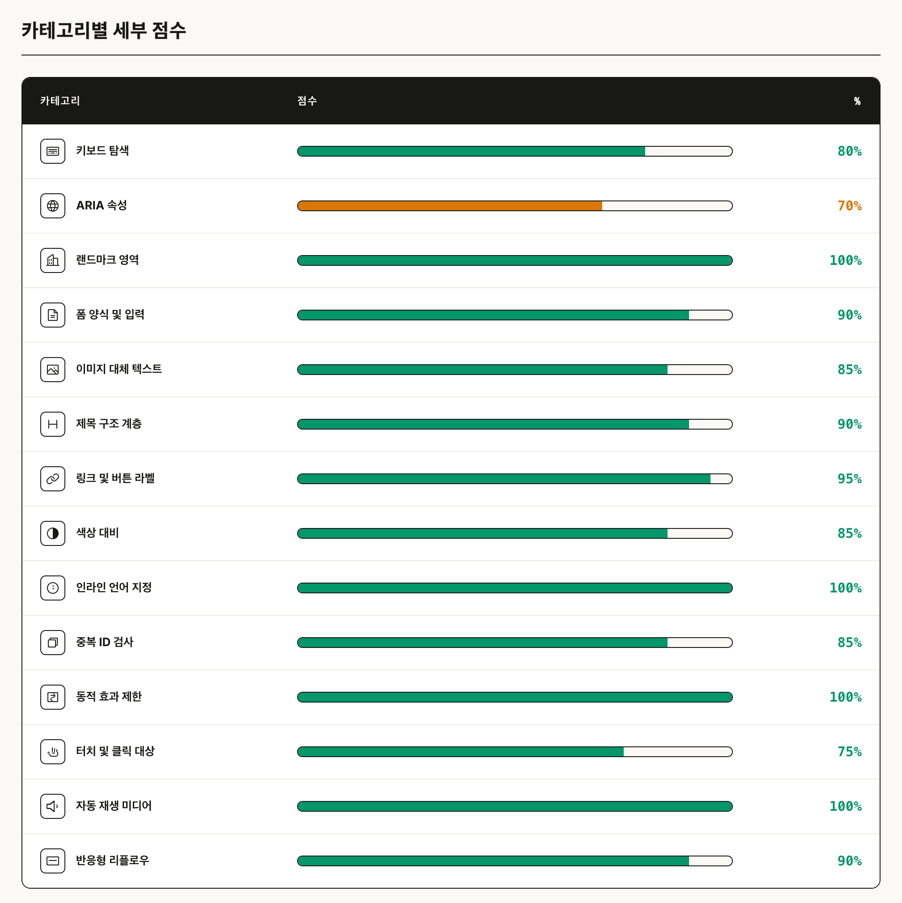
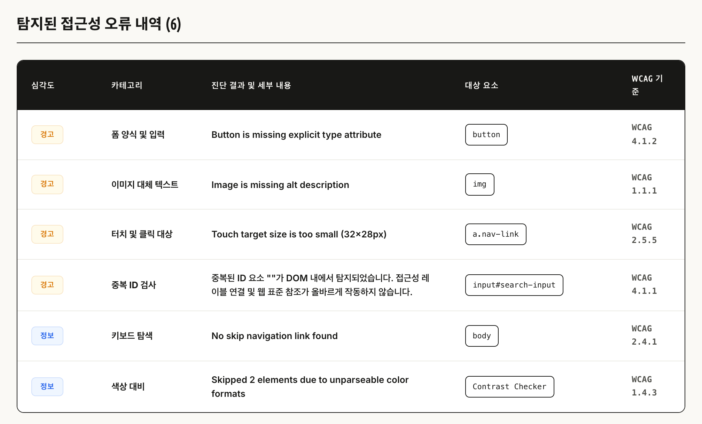

🌐 **[English Document (영어)](README.md)**

# A11y Analyzer — 크롬 익스텐션 (MVP)

웹페이지의 ARIA 및 키보드 접근성 문제를 진단합니다. 디자이너와 개발자를 위해 제작되었습니다.

## 스크린샷

<table style="table-layout: fixed; width: 100%;">
  <thead>
    <tr>
      <th align="center" style="width: 33.33%;">화면 1: 대시보드</th>
      <th align="center" style="width: 33.33%;">화면 2: 정밀 진단 중</th>
      <th align="center" style="width: 33.33%;">화면 3: 진단 결과</th>
    </tr>
  </thead>
  <tbody>
    <tr>
      <td valign="top" align="center" style="width: 33.33%;">
        
      </td>
      <td valign="top" align="center" style="width: 33.33%;">
        
      </td>
      <td valign="top" align="center" style="width: 33.33%;">
        
      </td>
    </tr>
  </tbody>
</table>

### 생성된 HTML 보고서 소개

진단 보고서는 완전히 독립적이고 반응성이 뛰어난 번역 지원 오프라인 대시보드로 동적 컴파일됩니다. 다음은 생성된 보고서의 주요 세션별 상세 안내입니다:

#### 1. 보고서 요약 및 종합 점수
<p align="center">
  
</p>

#### 2. 상세 페이지 통계
<p align="center">
  
</p>

#### 3. 영역별 상세 평가 및 점수
<p align="center">
  
</p>

#### 4. 상세 개선 문제 트래커
<p align="center">
  
</p>

---

## 설치 방법

1. 크롬(Chrome) 브라우저를 열고 `chrome://extensions` 주소로 이동합니다.
2. 우측 상단의 **개발자 모드(Developer mode)** 토글을 활성화합니다.
3. 좌측 상단의 **압축해제된 확장 프로그램을 로드(Load unpacked)** 버튼을 클릭합니다.
4. 본 확장 프로그램 폴더 (`a11y-extension/`)를 선택합니다.
5. 익스텐션 아이콘이 브라우저 툴바에 등록됩니다.

---

## 사용 방법

1. 진단하고자 하는 웹사이트를 엽니다.
2. 브라우저 툴바에서 A11y Analyzer 아이콘을 클릭합니다.
3. 화면 1(Dashboard)에서 기본 페이지 정보를 확인한 후 **Run Audit (정밀 진단 시작)** 버튼을 누릅니다.
4. 익스텐션이 14가지 세부 영역에 대해 즉시 접근성 평가를 진행합니다.
5. 화면 3(Results)에서 영역별 접근성 점수가 포함된 요약을 확인합니다.
6. **Download Report (보고서 다운로드)** 버튼을 클릭하여 결과 보고서를 HTML 파일로 저장합니다.

다운로드한 `.html` 파일을 모든 웹 브라우저에서 열어볼 수 있습니다.  
PDF로 내보내기: 보고서 열기 → Ctrl+P (인쇄) → PDF로 저장 선택.

---

## 진단 항목

| 평가 영역 | 가중치 | 진단 세부 내용 |
|----------------|--------|-----------------|
| 키보드 내비게이션 | 10%    | tabindex 표준 탐색 순서 교란 여부, 본문 바로가기 링크 존재 여부, 초점 링 시각적 비활성화 검출, 클릭 이벤트가 바인딩된 단순 div 트랩 |
| ARIA 속성      | 10%    | 올바른 ARIA role 사용 여부, 필수 속성 정의 누락 체크, 무분별한 aria-hidden 남용 감지, ARIA 요소 이름(Accessible Name) 생략 여부 |
| 랜드마크 영역   | 8%     | main, nav, header, footer 표준 랜드마크 존재 여부 및 명확한 이름 정의(Labeling) 상태 |
| 폼 양식 요소   | 10%    | label 요소와 input 요소의 정상적인 연동 상태, 필수 입력 필드 속성(aria-required) 정의, 관련 입력 필드셋 그룹화 상태(fieldset) |
| 색상 대비      | 10%    | 웹페이지 텍스트 요소와 배경 요소 간의 명도 대비율 정밀 계측 및 조상 투명도 블렌딩, 뷰포트 우선 샘플링 적용 계측 |
| 이미지 요소     | 8%     | alt 대체 텍스트 제공 상태, 무의미한 대체 값 정의 감지, 시각 장애인을 위한 SVG 그래픽 레이블 지정 상태 |
| 제목 구조       | 6%     | h1 요소의 단일 선언 여부, 논리적 제목 단계 계층(Heading Hierarchy) 검토, 비정상적 계층 생략(Skipped Levels) 진단 |
| 링크 및 버튼   | 4%     | 모호한 링크 레이블 지칭 여부(예: '더보기', '바로가기'), 빈 링크 태그, 새 창/새 탭 링크 목적지 고지 여부 |
| 인라인 언어 지정 | 5%     | 외국어 텍스트 블록에 매칭되는 lang 속성 부재 및 상위 상속 불일치 체크 (FR, DE, ES, PT, IT) |
| 중복 ID 검사   | 5%     | 페이지 전체 내 중복 ID 검사, 대화형 혹은 라벨 연결성(Label link) 침해 시 critical 격상 |
| 동적 효과 제한 | 6%     | prefers-reduced-motion 미디어 쿼리가 적용되지 않은 동적 CSS 애니메이션 및 트랜지션 필터링 |
| 터치 및 클릭 대상 | 8%     | 44x44px(하한선 24px) 미만의 너무 작고 정밀하지 않은 모바일 대화형 타겟 영역 검출 |
| 자동 재생 미디어 | 5%     | 음소거(muted) 처리 없이 소리를 동반하여 자동 재생되는 비디오/오디오 소스 감지 |
| 반응형 리플로우 | 5%     | 400% 줌(너비 320px) 가상 화면 구현을 통한 레이아웃 깨짐, 가로 스크롤바 유발, 본문 텍스트 소멸 진단 |

---

## 점수 체계

| 점수 구간 | 접근성 수준 |
|-------|-------|
| 90–100 | Excellent (최우수) |
| 75–89  | Good (우수) |
| 55–74  | Needs Work (보완 필요) |
| 0–54   | Poor (개선 시급) |

---

## 유의 사항

- 진단은 발견적 휴리스틱 알고리즘을 기반으로 합니다. 반드시 수동 접근성 평가를 병행하세요.
- 실제 스크린 리더 환경(Windows의 NVDA/JAWS, macOS/iOS의 VoiceOver)을 사용하여 보조 기기 호환성을 점검하세요.
- 색상 대비(Color Contrast) 문제 진단을 위해 전용 대비 분석기를 추가로 사용해 보시는 것을 권장합니다.
- 본 익스텐션은 외부 링크 경로를 직접 따라가며 분석하지 않으며, 활성화된 현재 페이지만 진단합니다 (MVP 버전에 해당).

---

## 파일 구조

```
a11y-extension/
├── manifest.json      크롬 익스텐션 설정 명세서 (MV3)
├── popup.html         메인 확장 프로그램 팝업 HTML 템플릿 (3가지 화면 정의)
├── popup.css          핵심 어플리케이션 스타일시트 (Alabaster, Sand & Indigo 테마)
├── animation.css      화면 2의 고해상도 접근성 정밀 스캔 애니메이션 스타일시트
├── popup.js           팝업 인터랙션 컨트롤러 및 오프라인 HTML 보고서 생성 엔진
├── content.js         웹페이지 접근성 진단 주입 스크립트 (14가지 카테고리 진단)
├── meta.js            다국어 텍스트 번역 데이터 및 기본 메타 환경설정 파일
├── .gitignore         Git 형상 관리에서 무시될 대상 규칙 설정
├── README.md          영문 설명서 및 설치 가이드 문서
├── README-ko.md       한국어 설명서 및 설치 가이드 문서
├── icons/             확장 프로그램 아이콘 폴더
│   └── icon.svg       모든 아이콘 규격 대응 단일 벡터 SVG 아이콘
├── images/            설명서 삽입용 제품 대시보드 및 오프라인 보고서 스크린샷 폴더
│   ├── screen1_v5.png
│   ├── screen1_ko_v5.png
│   ├── screen2_v5.png
│   ├── screen2_ko_v5.png
│   ├── screen3_v5.png
│   ├── screen3_ko_v5.png
│   ├── report_summary_v5.png
│   ├── report_summary_ko_v5.png
│   ├── report_stats_v5.png
│   ├── report_stats_ko_v5.png
│   ├── report_categories_v5.png
│   ├── report_categories_ko_v5.png
│   ├── report_issues_v5.png
│   └── report_issues_ko_v5.png
└── phosphor/          오프라인 폰트 전용 Phosphor 아이콘 및 웹폰트 리소스 폴더
    ├── style.css
    ├── Phosphor.ttf
    ├── Phosphor.woff
    └── Phosphor.woff2
```
