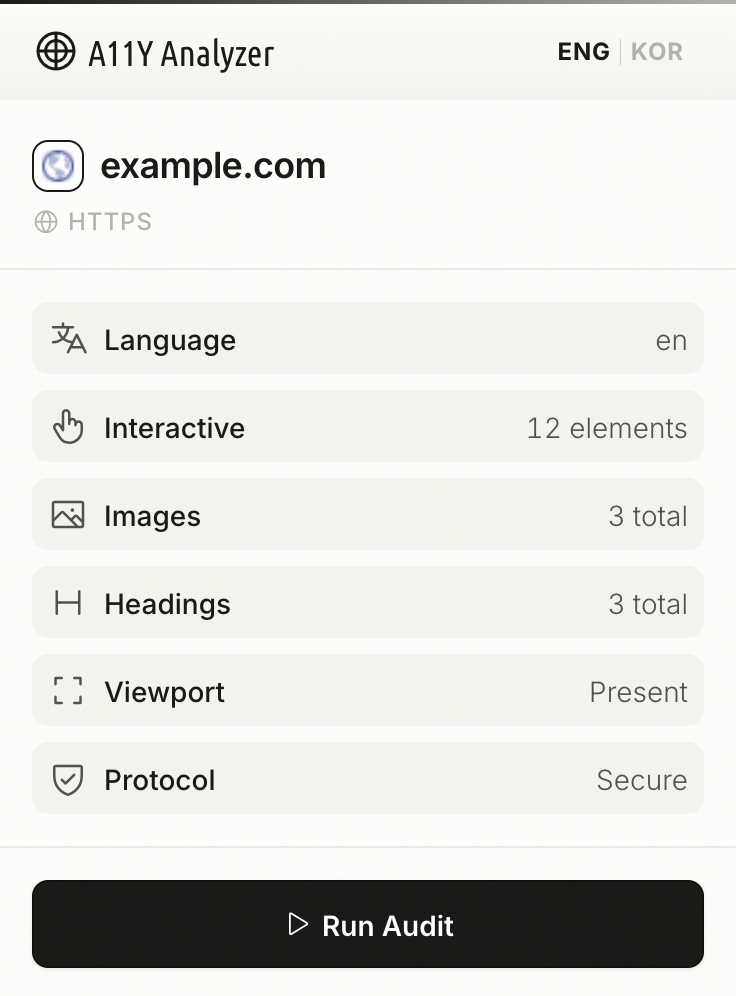
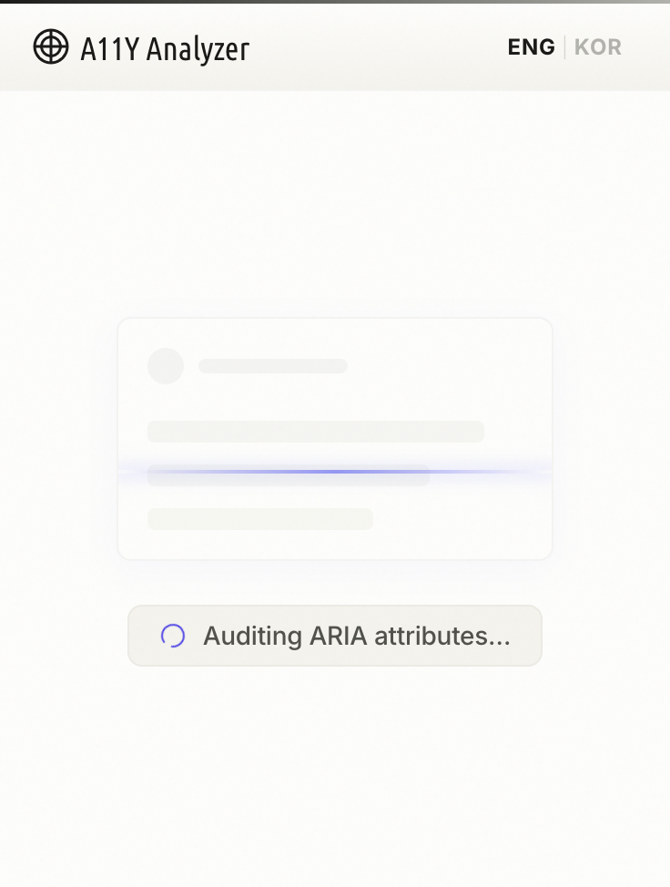
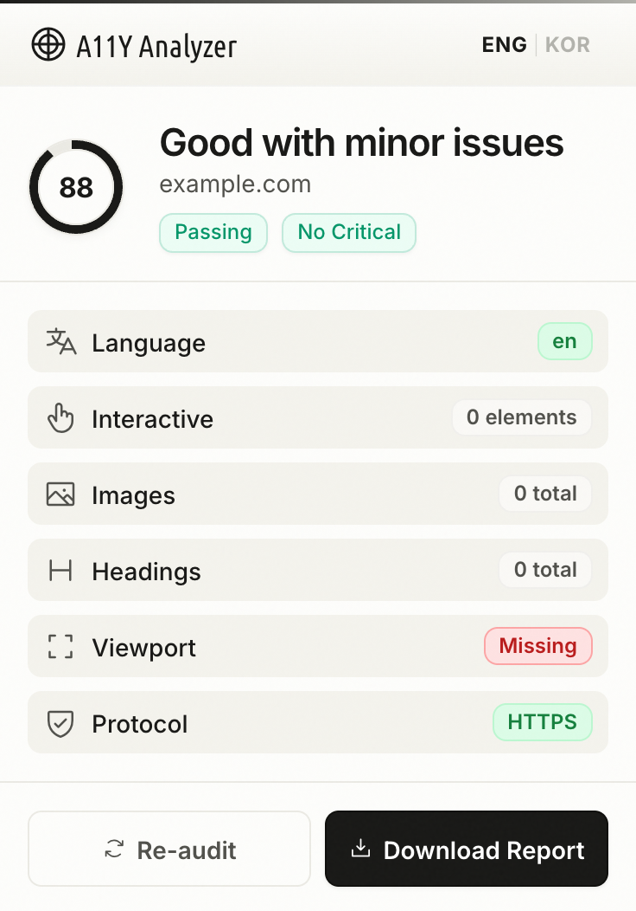
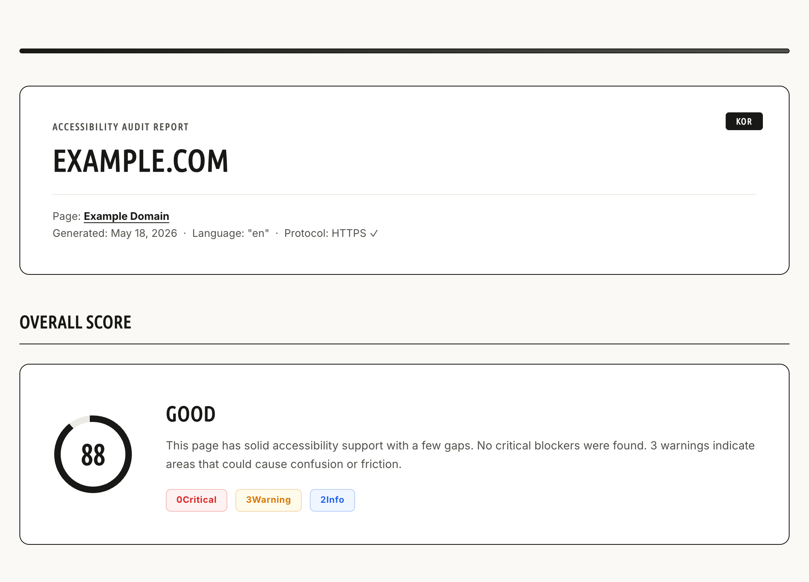

# A11y Analyzer — Chrome Extension (MVP)

Analyzes any webpage for ARIA and keyboard accessibility issues.
Designed for designers and developers.

## Screenshots

<table>
  <thead>
    <tr>
      <th align="center" width="33%">Screen 1: Dashboard</th>
      <th align="center" width="33%">Screen 2: Scanning</th>
      <th align="center" width="33%">Screen 3: Results</th>
    </tr>
  </thead>
  <tbody>
    <tr>
      <td valign="top" align="center">
        
      </td>
      <td valign="top" align="center">
        
      </td>
      <td valign="top" align="center">
        
      </td>
    </tr>
  </tbody>
</table>

### Generated HTML Report

<p align="center">
  
</p>

---

## Setup

1. Open Chrome and navigate to `chrome://extensions`
2. Enable **Developer mode** (top-right toggle)
3. Click **Load unpacked**
4. Select this folder (`a11y-extension/`)
5. The extension icon will appear in your toolbar

---

## How to use

1. Open any website you want to audit
2. Click the A11y Analyzer icon in the toolbar
3. Screen 1 shows basic page info — click **Run Audit**
4. The plugin scrolls the page while analyzing
5. Screen 3 shows a summary with category scores
6. Click **Download Report** to save an HTML report

Open the downloaded `.html` file in any browser.  
To export as PDF: open it → Ctrl+P → Save as PDF.

---

## What it checks

| Category       | Weight | What's analyzed |
|----------------|--------|-----------------|
| Keyboard Nav   | 20%    | tabindex order, skip links, focus indicators, clickable-div traps |
| ARIA           | 20%    | role validity, required attributes, aria-hidden misuse, missing names |
| Landmarks      | 15%    | main, nav, header, footer presence and labeling |
| Forms          | 15%    | label associations, aria-required, fieldset grouping |
| Images         | 15%    | alt attributes, empty vs descriptive alt, SVG labels |
| Headings       | 10%    | h1 presence, heading hierarchy, skipped levels |
| Links/Buttons  | 5%     | generic text, empty links, new-tab disclosure |

---

## Scores

| Range | Grade |
|-------|-------|
| 90–100 | Excellent |
| 75–89  | Good |
| 55–74  | Needs Work |
| 0–54   | Poor |

---

## Notes

- Analysis is heuristic-based. Always supplement with manual testing.
- Test with real screen readers: NVDA/JAWS (Windows), VoiceOver (macOS/iOS).
- Run a dedicated contrast checker (e.g. Colour Contrast Analyser) for color issues.
- This tool does not follow links — it audits the current page only (MVP).

---

## File structure

```
a11y-extension/
├── manifest.json      Chrome extension manifest (MV3)
├── popup.html         All 3 screens
├── popup.css          Styles (Indigo Ink, 8px grid, WCAG AA)
├── popup.js           Screen logic + report generation
├── content.js         Analysis engine (injected into active tab)
└── icons/
    ├── icon16.png
    ├── icon48.png
    └── icon128.png
```
